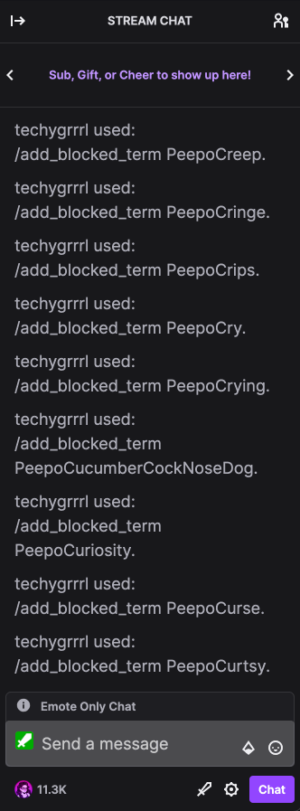
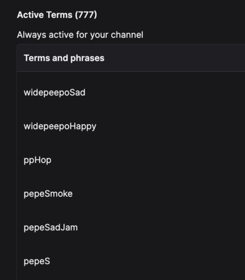

# Pepe the frog blocker for your Twitch chat

This project allows developers to add Pepe-related emotes as blocked terms.

- [Dependencies](#dependencies)
  - [Using without TAU](#using-without-tau)
- [Usage](#usage)
- [Other Usages](#other-usages)
- [Further Reading](#further-reading)

## Dependencies

- Ruby
- Your personal [TAU](https://github.com/Team-TAU/tau) instance. If you don't use TAU, see below [Using without TAU](#using-without-tau).

### Using without TAU

If you do not use TAU, you will need to:

- Change the URL to the official Twitch URL [Add Blocked Term endpoint](https://dev.twitch.tv/docs/api/reference#add-blocked-term). This is included but commented out.
- Acquire an access token another way (e.g. [twitch-cli](https://dev.twitch.tv/docs/cli/token-command))
- Remove the TAU authentication header, and replace it with the authentication headers [required by Twitch](https://dev.twitch.tv/docs/api#step-3-making-your-first-twitch-api-request)

You may also be able to do this with a bash script and the [twitch-cli](https://dev.twitch.tv/docs/cli/token-command).

If you do the same thing another way, please feel free to put up a PR or share your scripts with me another way and I can include them in the project.

## Usage

Run the script as follows:

    ruby block_pepes.rb

It will iterate through the terms, making a request for each, with a 2 second pause in between requests to avoid stressing your TAU server and running into Twitch rate limiting issues.

## Other Usages

You can use this script for any terms you'd like to block. Simply add a new file and change the file reference in the script. It can be handy if you download banned word lists elsewhere. Note: The data needs to be in the same format (an array of strings that can be parsed as JSON).

## Further Reading

- [Twitch: Add Blocked Term endpoint](https://dev.twitch.tv/docs/api/reference#add-blocked-term)
- [Twitch CLI](https://dev.twitch.tv/docs/cli/token-command)
- [Twitch: Authentication using the Twitch CLI](https://dev.twitch.tv/docs/api#step-2-authentication-using-the-twitch-cli)
- [Twitch: Making your first API request](https://dev.twitch.tv/docs/api#step-3-making-your-first-twitch-api-request)
- [Twitch API Unifier (TAU)](https://github.com/Team-TAU/tau)
- [Why block Pepe](why-block-pepe.md)
- [Getting the data](getting-data.md)